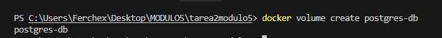
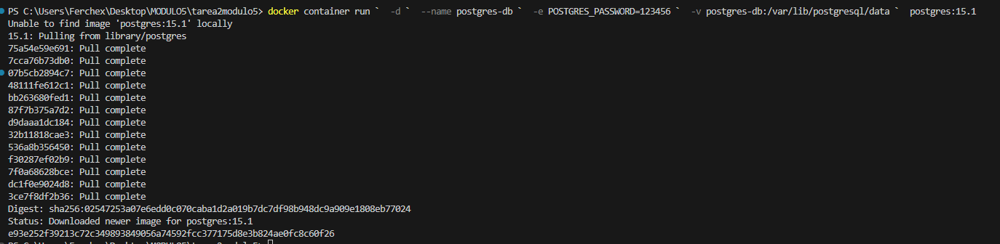
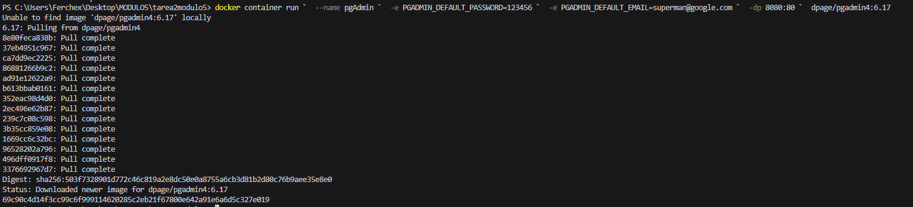
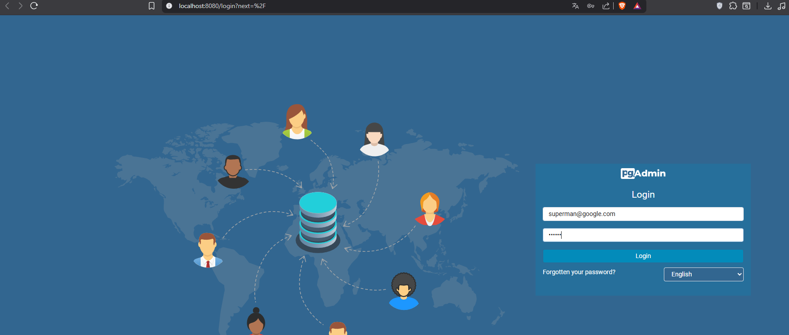
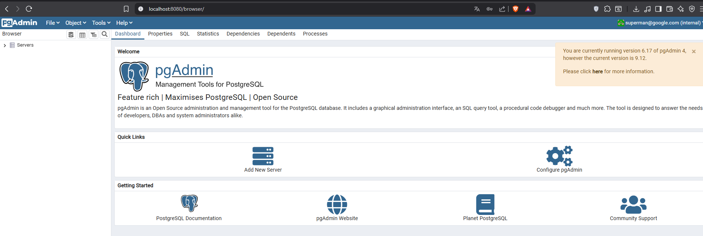
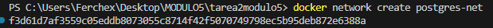
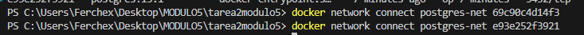
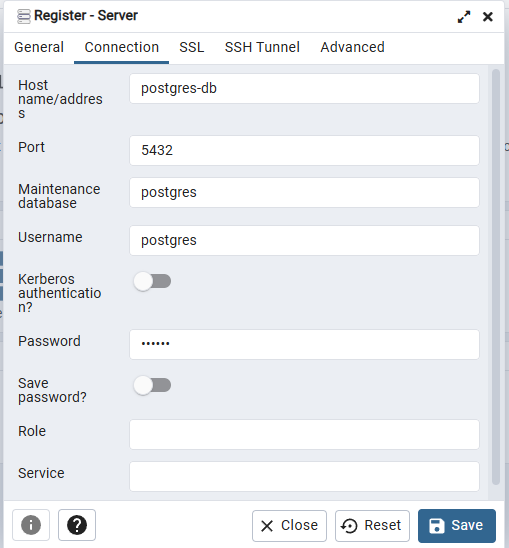

# Práctica 2 - Imágenes, Contenedores, Volúmenes, Network

## 1. Crear el volumen
```bash
docker volume create postgres-db
```



## 2. Montar la imagen de PostgreSQL
```powershell
docker container run `
  -d `
  --name postgres-db `
  -e POSTGRES_PASSWORD=123456 `
  -v postgres-db:/var/lib/postgresql/data `
  postgres:15.1
```



## 3. Montar pgAdmin
```powershell
docker container run `
  --name pgAdmin `
  -e PGADMIN_DEFAULT_PASSWORD=123456 `
  -e PGADMIN_DEFAULT_EMAIL=superman@google.com `
  -dp 8080:80 `
  dpage/pgadmin4:6.17
```



## 4. Ingresar a pgAdmin

Acceder a `http://localhost:8080` con las credenciales:
- Email: `superman@google.com`
- Password: `123456`



## 5. Conexión inicial (sin red)

Se intentó registrar el servidor con hostname `postgres-db` pero la conexión falló porque los contenedores no compartían red.



## 6. Crear la red
```powershell
docker network create postgres-net
```



## 7. Conectar los contenedores a la red
```powershell
docker network connect postgres-net pgAdmin
docker network connect postgres-net postgres-db
```



## 8. Registrar el servidor en pgAdmin

Con la red configurada, se registró el servidor:
- Host: `postgres-db`
- Username: `postgres`
- Password: `123456`



## 9. Crear base de datos y tabla

Se creó la base de datos `heroes` con la tabla `superheroes` y se insertaron registros.
```sql
CREATE TABLE superheroes (
    id SERIAL PRIMARY KEY,
    name VARCHAR(100),
    power VARCHAR(100),
    city VARCHAR(100)
);

INSERT INTO superheroes (name, power, city) VALUES
  ('Superman', 'Super strength', 'Metropolis'),
  ('Batman', 'Intelligence', 'Gotham'),
  ('Wonder Woman', 'Combat', 'Themyscira'),
  ('Flash', 'Super speed', 'Central City');

SELECT * FROM superheroes;
```


